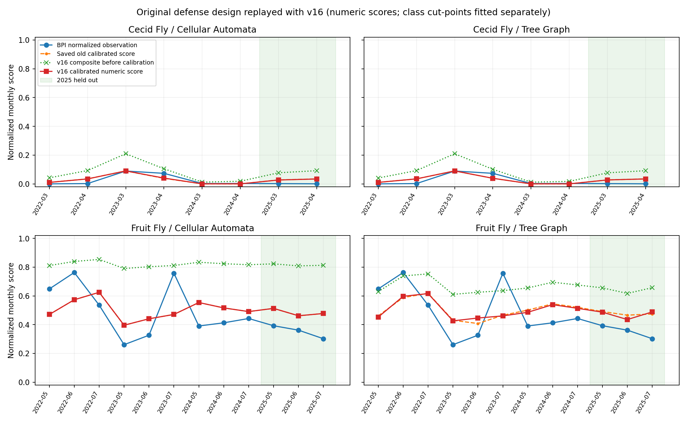

# Updated BPI historical validation defense

Evaluation date: 10 October 2026. Tested model: `2026.10-daylight-light-v16`.

This is a retained v16 evaluation. The [v17 model review](v17-model-readiness-review.md)
changes Fruit Fly source progression. The percentages below must not be
presented as results of the newer version; its BPI rerun is pending.

This evaluation replays the original enhanced defense design with the current
Cellular Automata and Tree-to-Tree Graph engines. It retains the 20 selected
cases and their historical weather, assumptions, scoring, observed carryover,
and calibration/testing split. It is separate from the broader
[46-month BPI audit](v16-sensitivity-and-bpi-validation.md).

## Design and what is actually tested

Each engine evaluates the same 20 pest-month cases: March/April Cecid and
May/June/July managed Fruit Fly in 2022, 2023, 2024, and 2025. Fruitlet stage is
assumed for Cecid and mature stage for Fruit Fly, corresponding to representative
30 and 75 days since flowering. These stages are calendar assumptions; the BPI
file does not contain measured fruit stages. The Cecid scope is the
fruit-attacking pest.

The archive supplies four 48-hour windows distributed across each selected
month. The forecast resets at every window; the four simulations do not form a
continuous eight-day or full-month population trajectory. Every window must
have 48 consecutive historical hours. Synthetic fallback and partial simulations
cause the replay to fail. Temperature, rainfall, humidity, wind speed, and
meteorological wind-from direction are taken from the bundled Open-Meteo archive.
Downwind transport uses the opposite direction, wind-from plus 180 degrees.

The CA orchard contains 400 unbagged tree cells on a synthetic 20 × 20 grid with
5 m cells. The graph uses the 194 mapped tree points in `data/trees.geojson`,
with crown widths divided by two to obtain radii. Its maximum edge distance is
fixed at the legacy default of 20 m for this experiment. That differs from the
current operational Fruit Fly graph's 25 m setting. A comparison between these
representations cannot isolate the effect of the algorithm from differences
in orchard geometry, tree count, and initial sources.

The replay runs 30 independent realizations per window and engine, totaling
4,800 realizations. It uses seed 42 plus window offset 1,000 and realization
index. CA source locations use the existing deterministic case-seeding rule.
The graph uses the exact saved tree-ID lists from the old defense. Source counts
are influenced by observed previous-month risk in the original design. The
initial Cecid source pressures are fixed at one assumed soil batch per source;
newly affected fruit cannot become new adult Cecid sources within the forecast.
The legacy source-to-host geometry path is retained in both engines; the newer
Cecid habitat-relay path is not enabled in this comparison.

No historical treatment, bagging, external neighbor pressure, measured soil
moisture, or pre-window adult histories are reconstructed. Fresh assumed sources
are initialized per window and antecedent rainfall defaults to zero. These are
experimental assumptions, not evidence that the historical orchard had no
treatment or that its soil was dry.

## Scoring and calibration

The final affected-cell/tree frequency across realizations provides each window's
spatial field. Initial sources are included. The existing composite formula is
retained:

```text
spatial = 0.25 × mean(window mean frequency)
        + 0.25 × mean(window 90th percentile)
        + 0.20 × max(window mean frequency)
        + 0.15 × mean(window area with frequency ≥ 0.30)
        + 0.15 × max(window area with frequency ≥ 0.50)

composite before calibration = (1 − carryover) × (0.70 × spatial + 0.30 × weather suitability)
                            + carryover × observed previous-month BPI risk
```

Carryover is 0.65 for Cecid and 0.10 for Fruit Fly. Therefore the exported
"raw" composite already contains historical BPI information and a separate
weather suitability term. It is not a pure simulator-only prediction. The case
table exports the spatial, weather, and observed-prior contributions separately.

The weather suitability formula is unchanged from the original validator:
Cecid weights sampled rainfall, humidity, and low wind at 0.60/0.25/0.15; Fruit
Fly weights temperature, humidity, a rainfall penalty, and low wind at
0.50/0.25/0.15/0.10. Those empirical comparison weights are separate from the
engines' hourly biological gates.

BPI Cecid infestation percentages are divided by 100; managed Fruit Fly CPTD is
divided by 40 and clipped to [0, 1]. Original category boundaries are retained:
Cecid 5%/15% and Fruit Fly 8/20 CPTD. This places unlike measurements on a shared
comparison scale; it does not make fruit infestation and trap catch equivalent
to affected-tree probability.

Only the 15 cases from 2022–2024 fit calibration: six Cecid and nine Fruit Fly.
Calibration fits a nonnegative affine numeric curve per pest and separately
optimizes two raw-score category cut-points on the calibration cases. The frozen
curves and cut-points are then applied to the five selected 2025 cases. A fitted
category can differ from the category implied by the calibrated numeric score;
both are retained in the case table. No biological coefficients are changed to
improve agreement.

Previous-month BPI observations from 2025 may be used as already-observed inputs
to subsequent 2025 cases. This is a retrospective comparison with monthly
observed updates, not an unattended forecast of the whole held-out year.

## Relationship to the saved defense

The original tables are preserved in `outputs/validation_defense_enhanced/` and
the old 40-row case table is also retained as
[the reference CSV](v16-defense-legacy-reference.csv). Both old engines reported
18/20 overall class matches, 13/15 calibration matches, and 5/5 held-out matches.
The replay checks that dates, pests, observations, assumed stages, carryovers,
and split labels still match that reference.

The saved export does not contain its realization counts, RNG seed, graph edge
cutoff, or executable Tree Graph aggregation helper. The replay explicitly fixes
those choices, including a common final affected-frequency field for both
engines. Consequently this is a reconstruction of the documented defense design;
any old/current difference cannot be attributed exclusively to v16 biology.
The first source-only Cecid graph case reproduces the old composite to its saved
six-decimal precision, providing a limited check on scoring/source reconstruction.

## Results

All 4,800 realizations completed: 20 cases × two engines × four windows ×
30 realizations. All 160 case/engine/window entries use consecutive historical
hours, with no synthetic fallback.

| Engine and version | Overall matches | Calibration matches | 2025 matches | MAE | RMSE | R² |
|---|---:|---:|---:|---:|---:|---:|
| Saved old Cellular Automata | 18/20 (90%) | 13/15 (86.7%) | 5/5 (100%) | 0.092297 | 0.119953 | 0.775750 |
| Current v16 Cellular Automata | 18/20 (90%) | 13/15 (86.7%) | 5/5 (100%) | 0.092137 | 0.119909 | 0.775914 |
| Saved old Tree Graph | 18/20 (90%) | 13/15 (86.7%) | 5/5 (100%) | 0.091226 | 0.118889 | 0.779709 |
| Current v16 Tree Graph | 18/20 (90%) | 13/15 (86.7%) | 5/5 (100%) | 0.090611 | 0.119348 | 0.778005 |

Class agreement is unchanged from the saved defense. Numeric errors differ
slightly: Tree Graph's current MAE is lower than its saved MAE, but its RMSE is
slightly higher. These small differences do not establish improvement, especially
given the missing old execution settings and different spatial representations.
The old numeric metrics are recomputed from the rounded saved case scores, so
their last displayed digit can differ from the original full-precision table.

Both current engines match all eight selected Cecid classes and 10 of 12 Fruit
Fly classes. Their two mismatches are the same:

| Case | BPI managed Fruit Fly | Actual class | CA final class | Tree Graph final class |
|---|---:|---|---|---|
| May 2022 | 25.93 CPTD | High | Medium | Medium |
| July 2023 | 30.29 CPTD | High | Medium | Medium |

Each engine detects two of the four selected High Fruit Fly cases: High recall
is 50%, precision is 100%, and High F1 is 0.667. All four High cases belong to
calibration; there are no held-out High cases. The held-out results therefore
provide no estimate of High-outbreak recall.

### Raw scores, calibration, and baselines

| Prediction | CA overall class agreement | Graph overall class agreement | CA 2025 agreement | Graph 2025 agreement |
|---|---:|---:|---:|---:|
| Composite before calibration | 8/20 (40%) | 8/20 (40%) | 0/5 (0%) | 0/5 (0%) |
| Training-fitted category cut-points | 18/20 (90%) | 18/20 (90%) | 5/5 (100%) | 5/5 (100%) |
| Training-majority class | 14/20 (70%) | 14/20 (70%) | 5/5 (100%) | 5/5 (100%) |
| Previous observed month's class | 16/20 (80%) | 16/20 (80%) | 5/5 (100%) | 5/5 (100%) |

The pre-calibration composite is classified with the original BPI-equivalent
normalized cutoffs. It overclassifies every selected 2025 record. Training-fitted
cut-points restore the saved defense's agreement, but do not beat either simple
baseline on the five held-out classes.

The numeric comparison also favors the simple held-out baselines:

| Held-out prediction | Combined normalized MAE | Cecid normalized MAE | Fruit Fly normalized MAE |
|---|---:|---:|---:|
| Current calibrated CA | 0.090891 | 0.029337 | 0.131927 |
| Current calibrated Tree Graph | 0.082759 | 0.029744 | 0.118102 |
| Per-pest training median | 0.054970 | 0.001550 | 0.090583 |
| Previous observed month's value | 0.030290 | 0.005100 | 0.047083 |

The category baseline uses each pest's training-majority class; the numeric
baseline uses that pest's training median. They are separate simple predictors.
These results do not show added held-out skill from the calibrated simulations
over those baselines.

### What produced the agreement

All 12 CA Fruit Fly cases have mean final affected frequency and spatial score
exactly 1.0. The CA composite therefore varies through weather suitability and
observed previous-month BPI risk, rather than differences in spatial spread.
Tree Graph Fruit Fly mean final affected frequency varies from 0.4873 to 0.7271;
this avoids the same saturation, but still does not beat the held-out baselines.

Cecid's simulation term is small relative to its separate weather/prior terms.
For March 2023, observed February infestation supplies 0.1781 of the approximately
0.2095 raw composite—about 85% of the score in either engine. Correctly matching
that Medium record does not independently validate soil emergence or spread.

The fitted Cecid raw High cut-point is 1.0 in both engines, reflecting the
absence of High Cecid training cases. The fitted Fruit Fly raw Low cut-point is
0.0, reflecting the absence of Low Fruit Fly training cases. This subset cannot
establish performance across all categories for either pest.

The optimized class and numeric-threshold class disagree in four CA cases and
three Tree Graph cases. For example, CA's calibrated May 2025 score is 0.5130,
which is High under the numeric Fruit Fly 0.50 cutoff, but its optimized raw-score
cut-points label the case Medium. The reported 5/5 test agreement uses the
optimized class cut-points, not classification of the calibrated numeric score.



### Suggested defense wording

“Using the original enhanced historical comparison design, both current
MangoPoint engines matched 18 of 20 selected BPI pest-month classes. Calibration
used 2022–2024 only, and both matched all five selected 2025 classes. However,
the held-out subset contained no High cases and was equally matched by simple
baselines. These results describe calibrated historical aggregate agreement
under stated inputs; they do not establish individual-tree forecasting accuracy.”

Use the complete report and broad audit when presenting this wording. The two
missed High Fruit Fly records, CA saturation, observed carryover, and absent
cloud/radiation data should remain visible in the discussion.

## Limits on a defense claim

The eight selected Cecid cases comprise six Low and two Medium records; none
are High. The
five-case 2025 test contains two Low Cecid records and three Medium managed Fruit
Fly records. The training-majority baseline predicts Low for Cecid and Medium
for Fruit Fly and already matches all five test cases. A 100% held-out agreement
therefore does not, by itself, demonstrate forecasting skill or outbreak
detection. There are no held-out High cases in this subset.

The selected calendar excludes important BPI Cecid observations, including 48%
in January 2022, 27.4% in February 2023, and 8.15% in May 2023. The broader audit
retains these months and must accompany this defense; this reconstruction does
not supersede its accuracy limitations.

The historical weather archive lacks cloud cover and instantaneous GHI/DNI.
The current model can still evaluate dated solar twilight, rainfall, temperature,
and wind, but these records cannot validate the new cloudy-daylight allowance.
No shade or light readings are invented to fill that gap. Open-Meteo archive
weather is modeled/reanalysis data, not local field sensor measurements.

Monthly fruit infestation and trap counts cannot validate individual tree
locations, source-to-tree routes, emergence times, egg counts, or a 48-hour
affected-tree forecast. Additional dated per-tree field observations remain
necessary. The appropriate defense is a historical aggregate risk-class
comparison under stated assumptions, rather than demonstrated tree-level
forecast accuracy.

## Reproduction and evidence

```bash
python -m scripts.run_defense_replay --monte-carlo 30 --workers 4
python -m pytest tests/test_defense_replay.py -q
```

Artifacts are in `outputs/validation_defense_v16/`:

- `replay_manifest.json`: fixed settings, source/input hashes, and missing inputs.
- `defense_case_results.csv`: both engines, old/current scores and classes,
  calibration, baselines, and score contributions.
- `defense_metrics.csv`: overall, calibration, and testing results by engine and
  pest, including raw/calibrated/old and baseline comparisons.
- `defense_weather_windows.csv`: all 160 case/engine/window entries with exact
  start/end dates, weather statistics, source locations, and realization seeds.
- `calibration.json`: training-only numeric curves and class cut-points.
- `defense_comparison.png`: both engines and pests against BPI observations.

Compact result tables are retained beside this report for review even when the
ignored `outputs/` directory is absent:

- [Model comparison](v16-defense-model-comparison.csv).
- [All 40 case results](v16-defense-case-summary.csv).
- [Metrics by period, pest, and predictor](v16-defense-metrics.csv).
- [Run settings and provenance](v16-defense-replay-manifest.json).

CSV files can be opened in Excel. The output directory also contains
`chapter4_v16_validation_results_table.csv`,
`chapter4_v16_validation_configuration_table.csv`, and
`chapter4_v16_validation_discussion.md` for the updated defense package.

Verification: the full Python suite passed 785 tests, including 13 replay
safeguards covering reference consistency, source IDs, historical coverage,
failed simulations, component accounting, and separation of calibration from
held-out outcomes. Recorded biological, scoring, and calibration source hashes
were unchanged throughout the simulations; no production model or database
changes were made for this replay.
